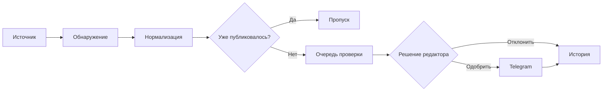

<div align="center">
  

# UnixGram Changelog

**Техническая летопись изменений UnixGram**

[](https://github.com/jutsu-dev/UnixGramChangelog/actions/workflows/ci.yml)
[](https://www.python.org/)
[](https://docs.aiogram.dev/)
[](LICENSE)

[Telegram-канал](https://t.me/UnixGramChangelog) · [Бот](https://t.me/UnixGramChangelogBot) · [UnixGram History](https://t.me/unixgramhistory)
</div>

---

UnixGram Changelog обнаруживает, проверяет и сохраняет изменения экосистемы UnixGram. Проект отделяет факты от слухов: автоматизация собирает данные и готовит запись, а редактор подтверждает смысл, источник и момент публикации.

## Зачем он нужен

- быстро находить новые функции, исправления и эксперименты;
- сохранять проверяемую историю с источниками;
- не терять важное среди обычных новостей;
- подключать новые источники без переписывания Telegram-бота;
- предотвращать повторные публикации.

## Как проходит изменение



Источники не имеют доступа к каналу. Публикация возможна только через единый `Publisher`, после сохранения записи и проверки прав администратора.

## Категории

| | Категория | Тег |
|---|---|---|
| ✨ | новая функция | `#feature` |
| 🎨 | интерфейс | `#interface` |
| 🛠 | исправление | `#fix` |
| ⚙️ | техническое изменение | `#technical` |
| 🧪 | эксперимент | `#experiment` |
| 🔎 | обнаруженная функция | `#discovery` |
| 🔌 | API | `#api` |
| 📱 | клиент | `#client` |
| 🚨 | важное обновление | `#important` |

Полная спецификация: [формат changelog](docs/CHANGELOG_FORMAT.md).

## Возможности бота

- редакционная очередь с предпросмотром;
- публикация и отклонение кнопкой;
- HTML-разметка с экранированием пользовательских данных;
- plain-text fallback при ошибке Telegram entities;
- история опубликованных записей и ID сообщений;
- SHA-256 fingerprint и `external_id` против дублей;
- изоляция сбоев отдельных источников;
- доступ к управлению только для `ADMIN_IDS`.

## Быстрый запуск

Требуются Python 3.12+ и Telegram-бот с правом публикации в канал.

```bash
git clone https://github.com/jutsu-dev/UnixGramChangelog.git
cd UnixGramChangelog
python -m venv .venv
.venv/Scripts/activate
python -m pip install -e ".[dev]"
copy .env.example .env
```

Заполните `.env` локально:

```dotenv
BOT_TOKEN=your_bot_token
CHANNEL_ID=@UnixGramChangelog
ADMIN_IDS=123456789
DATABASE_PATH=data/changelog.db
```

```bash
unixgram-changelog
```

С Docker:

```bash
docker compose up --build -d
```

Для постоянного запуска на Linux подготовлен unit-файл
[`deploy/unixgram-changelog.service`](deploy/unixgram-changelog.service). Секреты хранятся
в `/etc/unixgram-changelog.env`, база данных находится в `/var/lib/unixgram-changelog`.

> Никогда не добавляйте `.env`, токены, cookies или пароли в Git. Для CI и production используйте GitHub Secrets или менеджер секретов сервера.

## Редакционный интерфейс

```text
/new feature | Поиск по подаркам | В каталоге появился поиск... | UnixGram | https://unixgram.com/...
```

Бот создаст предпросмотр. После подтверждения запись появится в канале, а ID публикации сохранится в SQLite. `/queue` показывает очередь, `/history` показывает последние публикации, `/types` содержит допустимые категории.

## Структура

```text
src/unixgram_changelog/
├── bot.py          редакционный Telegram-интерфейс
├── formatting.py   формат постов и экранирование
├── ingestion.py    сбор из независимых источников
├── publisher.py    единственная точка публикации
├── storage.py      история и защита от дублей
└── sources/        расширяемые адаптеры источников
```

Подробнее: [архитектура](docs/ARCHITECTURE.md) · [добавление источника](docs/ADDING_A_SOURCE.md) · [безопасность](docs/SECURITY.md).

## Roadmap

- [x] модель записи и единый формат публикаций;
- [x] очередь ручной проверки;
- [x] история и дедупликация;
- [x] расширяемый контракт источников;
- [ ] адаптеры публичных UnixGram API и GitHub releases;
- [ ] сравнение стабильных snapshot без динамического шума;
- [ ] вложения и галерея доказательств;
- [ ] редактирование опубликованной записи с журналом ревизий;
- [ ] PostgreSQL и отдельные workers при росте нагрузки;
- [ ] наблюдаемость: healthcheck, метрики и уведомления редакции.

## Разработка

```bash
ruff check .
mypy src
pytest -q
```

Правила участия находятся в [CONTRIBUTING.md](CONTRIBUTING.md). История проекта находится в [CHANGELOG.md](CHANGELOG.md).

## Статус и независимость

Проект развивается сообществом [UnixGram History](https://t.me/unixgramhistory). Это независимый open-source проект и не официальный продукт команды UnixGram.

## Лицензия

[MIT](LICENSE) © 2026 UnixGram History contributors.
