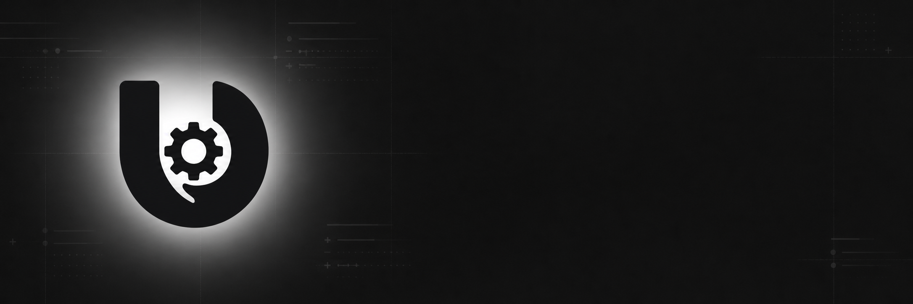
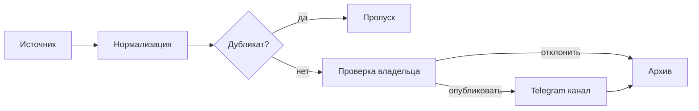

<div align="center">
  

# UnixGram Changelog

**Проверяемая история изменений UnixGram**

[](https://github.com/jutsu-dev/UnixGramChangelog/actions/workflows/ci.yml)
[](https://www.python.org/)
[](https://docs.aiogram.dev/)
[](#доступ)
[](LICENSE)

[Канал](https://t.me/UnixGramChangelog) · [Бот](https://t.me/UnixGramChangelogBot) · [UnixGram History](https://t.me/unixgramhistory)
</div>

## Один канал. Одна история. Проверяемые источники.

UnixGram меняется быстро. Этот проект собирает находки в редакционную очередь, защищает канал от повторов и сохраняет ссылку на источник у каждой публикации. Решение о публикации всегда принимает владелец.

| Что происходит | Как это работает |
|---|---|
| Находка попадает в очередь | бот нормализует поля и вычисляет fingerprint |
| Запись проверяется | владелец видит готовую карточку и источник |
| Запись одобряется | единый Publisher отправляет её в канал |
| История сохраняется | SQLite хранит статус и Telegram message ID |



## Редакторская панель

Управление работает только в личном чате владельца. Остальные сообщения и callback-запросы молча отбрасываются до обработчиков.

```text
/new feature | Поиск по подаркам | В каталоге появился поиск | UnixGram | https://unixgram.com/...
```

После проверки бот показывает карточку с действиями «Опубликовать» и «Отклонить». `/queue` открывает очередь, `/history` показывает последние записи, `/types` выводит допустимые категории.

В интерфейсе используются иконки из набора [Telegram iOS Icons](https://t.me/addemoji/tgiosicons). Если custom emoji недоступны конкретному клиенту, бот автоматически повторяет сообщение с обычными Unicode-иконками.

Пост в канале содержит:

- тип изменения и стабильный поисковый тег;
- короткий заголовок без обрезанной разметки;
- описание с безопасным HTML-экранированием;
- кликабельный подтверждающий источник;
- plain-text fallback при ошибке Telegram entities.

## Категории

| Код | Назначение | Тег |
|---|---|---|
| `feature` | новая функция | `#feature` |
| `interface` | интерфейс | `#interface` |
| `fix` | исправление | `#fix` |
| `technical` | техническое изменение | `#technical` |
| `experiment` | эксперимент | `#experiment` |
| `discovery` | обнаруженная возможность | `#discovery` |
| `api` | API | `#api` |
| `client` | клиент | `#client` |
| `important` | важное обновление | `#important` |

Полные правила находятся в [спецификации формата](docs/CHANGELOG_FORMAT.md).

## Доступ

Production настроен на одного владельца:

- конфигурация принимает ровно один Telegram ID;
- сообщения разрешены только от владельца и только в private chat;
- неизвестным пользователям бот ничего не отвечает;
- публикация недоступна источникам и выполняется через единый Publisher;
- production secrets хранятся вне репозитория;
- deploy запускается только из ветки `main` через защищённое GitHub Environment
- публичный репозиторий не содержит production secrets и прав доступа

Права на самостоятельный запуск, копирование, модификацию и хостинг не передаются. Условия зафиксированы в [LICENSE](LICENSE). Реальная защита production строится на owner-only доступе, внешних секретах и отдельном deploy-контуре.

Подробнее: [модель безопасности](docs/SECURITY.md) и [политика раскрытия](SECURITY.md).

## Устройство проекта

```text
src/unixgram_changelog/
├── access.py        owner-only граница доступа
├── bot.py           редакционная панель
├── formatting.py    Telegram HTML и fallback
├── ingestion.py     приём изменений от источников
├── notifications.py личные уведомления владельца
├── publisher.py     единственная точка публикации
├── storage.py       история и защита от дублей
├── ui.py            меню и визуальная система
└── sources/         адаптеры источников
```

| Документ | Содержание |
|---|---|
| [Архитектура](docs/ARCHITECTURE.md) | поток данных и границы компонентов |
| [Новый источник](docs/ADDING_A_SOURCE.md) | контракт и правила подключения |
| [Формат changelog](docs/CHANGELOG_FORMAT.md) | поля, категории и ограничения |
| [Deploy](docs/DEPLOY.md) | выкладка, backup и rollback |
| [Security](docs/SECURITY.md) | угрозы, секреты и контроль доступа |

## Проверки

```bash
ruff check .
mypy src
pytest -q
```

CI выполняет те же проверки перед deploy. Правила участия находятся в [CONTRIBUTING.md](CONTRIBUTING.md), история версий в [CHANGELOG.md](CHANGELOG.md).

## Статус проекта

UnixGram Changelog развивается командой [UnixGram History](https://t.me/unixgramhistory). Это независимый проект сообщества и не официальный продукт команды UnixGram.

## Право использования

[All rights reserved](LICENSE), 2026 UnixGram History.
